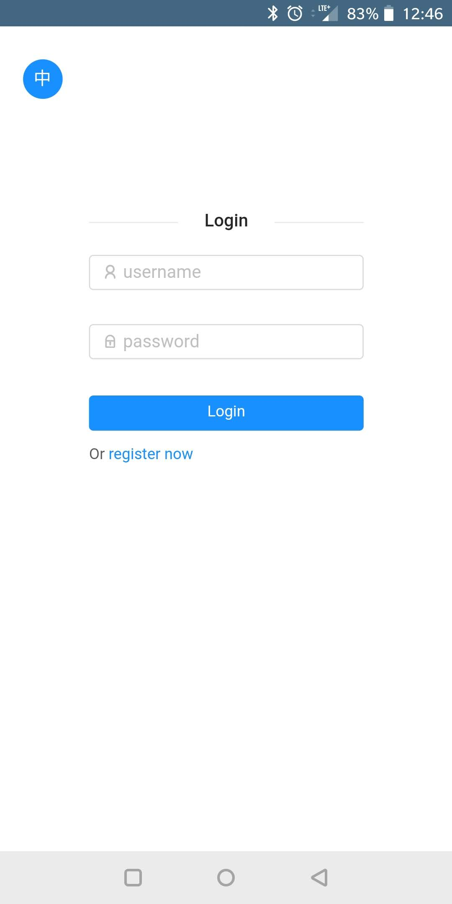
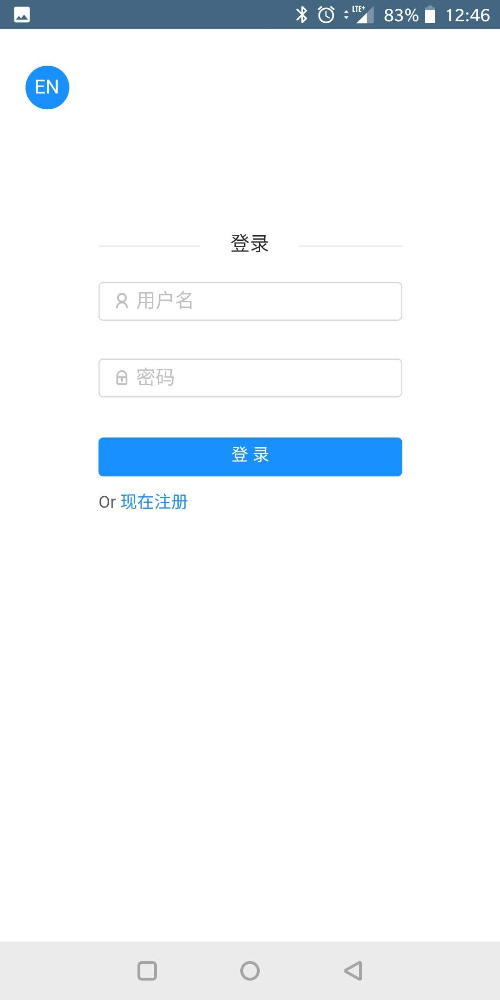
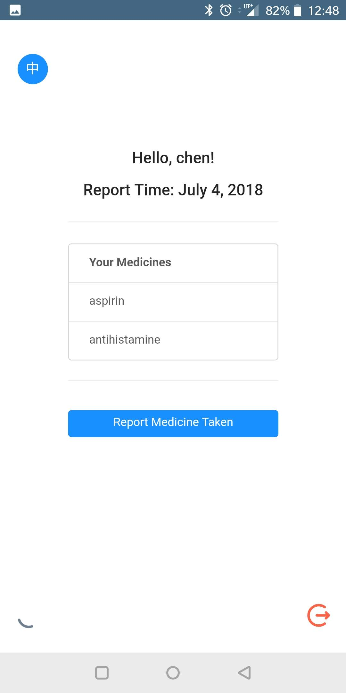
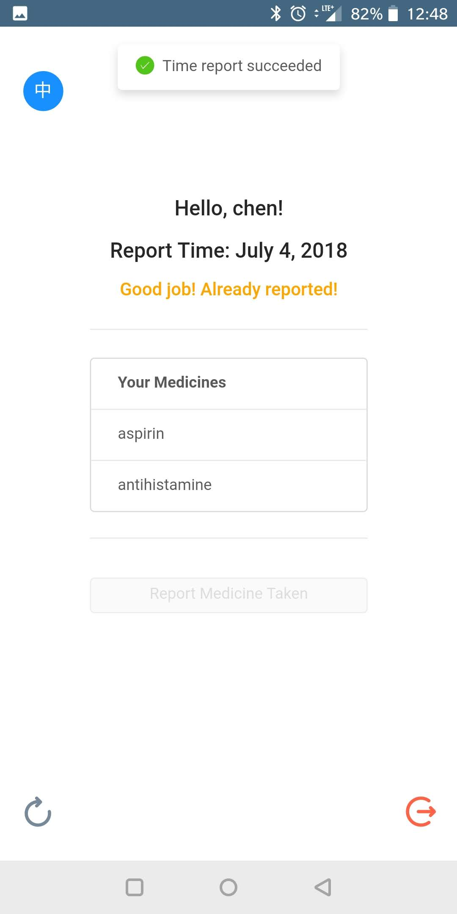
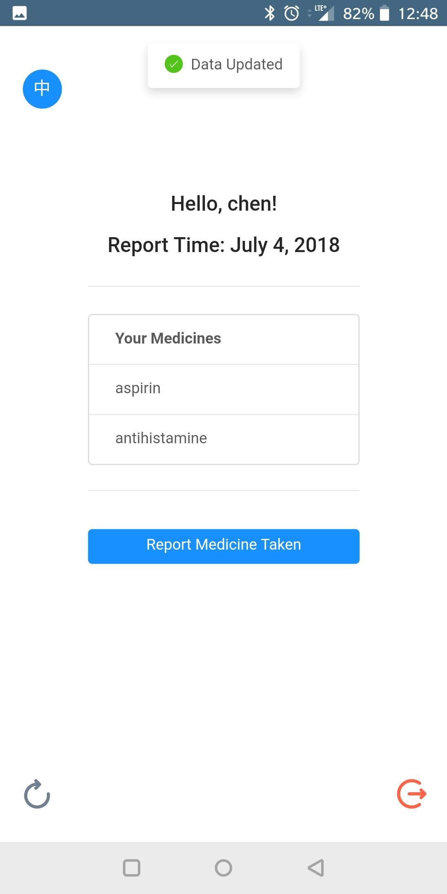
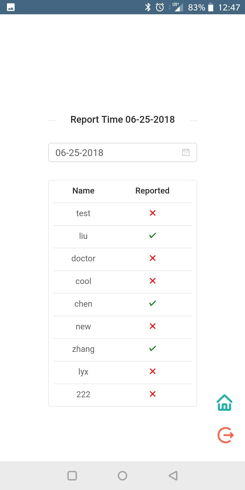
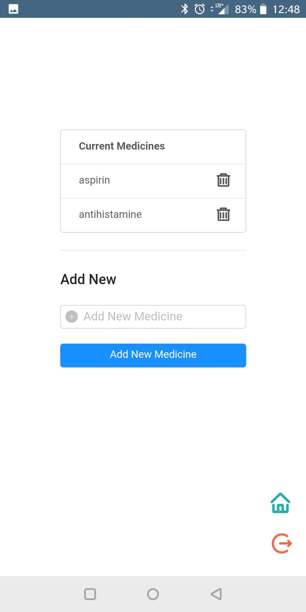

# Med Schedule

## What is this?

- Responsive Web App that record the medicine taken status (for medicine clinical trial research).
- Doctor can specify medicines, and view the med taken history by days.
- Patient/volunteers need to report that they took the medicine everyday.
- Has English/Chinese support. Language can be switched in one click.

## Demo Website

- https://biteapie.com
- Doctor Account: doctor/doctor
- Patient Account: test/test

## What can it do?

### Login with different roles

- There are two user roles: doctor and patient. The login page is the same.
- Two languages (English/Chinese) can switch using top-left icon

<p float="left">


</p>
<div style="clear: both;"></div>

### Patients View

- After patient login, the daily report page will display. There's only one functional button (besides language switch button) that patient can click, which is the report button.
- Patient should click report button when they take the medicine for a certain day. Report button will be disabled after reporting until next day.

<p float="left">



</p>
<div style="clear: both;"></div>

### Doctor View

- After doctor login, there are two options "manage medicines", and "view med taken history".
- In "manage medicines" page, doctor can specify (add/delete) the medicines patient should take daily. These med info will display on patient view.
- In "view med taken history" page, doctor can select a certain date, to see the med-taken status. A green check will appear on right of patient name only if already reported in that day.

<p float="left">


<div style="clear: both;"></div>
</p>

## How to build?

### Install app dependencies

```bash
# install global npm package which helps run the app
npm install -g nodemon
npm install -g serve

# install dependencies for both server and client side
cd server
npm install

cd ../client
npm install
```

### Run in local dev mode

```bash
# Assume you're in the root directory

# Go to server directory first, run server-side first
cd server
npm start

# Then go to client directory, run client-side
cd ../client
npm install
```

### Run in production mode

- For the client side, production ready bundle file can be achieved by running `npm run build`, then you can serve it use the web-server of your choice (Nginx or Apache)
- For the server side, there are few options to run it, and keep it running. I would recommend a tool called PM2 which can help manage Node processes very easily

## Project idea origin & history

My friend liuchengyu (https://github.com/HomoSapienLCY) is a PHD student in UCSD. He contacted me about the idea of creating an application that can record medicine taken status for clinical trial. We brainstormed together and refined MVP features.  
Before contacting me, liuchengyu already have some base-code structure setup. Then after our discussion, I replaced the project structure to use the boilerplate structure from my previous project "itstime" and "giphy search", which is clearer and good for fast development.  
Then since liychengyu were busy with his PHD work, I'm in charge of finish writing the application. I demo to liuchengyu whenever there're new features built, to get advice regard feature details. Now all the main features are finished, and I deployed on a test server for demo purpose. In the future, it's possible that we can further polish the app, and put it in actual usage.

## Tech Stacks

- Server-side: NodeJS, Express, MongoDB
- Client-side: React, Redux, Moment.js, Ant Design
